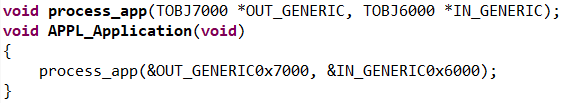
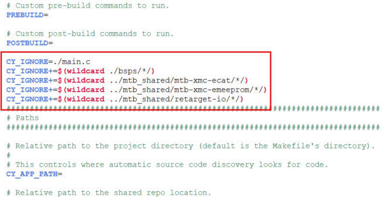

# XMC4800 EtherCAT SSC

This code example demonstrates the implementation of an EtherCAT slave node using the Beckhoff Slave Stack Code (SSC) Tool to generate the slave stack code for XMC4800 Relax EtherCAT Kit.

[View this README on GitHub.](https://github.com/Infineon/mtb-example-xmc48-ethcat-ssc)

[Provide feedback on this code example.](https://cypress.co1.qualtrics.com/jfe/form/SV_1NTns53sK2yiljn?Q_EED=eyJVbmlxdWUgRG9jIElkIjoiQ0UyNDE3MzQiLCJTcGVjIE51bWJlciI6IjAwMi00MTczNCIsIkRvYyBUaXRsZSI6IlhNQzQ4MDAgRXRoZXJDQVQgU1NDIiwicmlkIjoic2lsc3VlcHVlcmJlcmtheSIsIkRvYyB2ZXJzaW9uIjoiMS4wLjAiLCJEb2MgTGFuZ3VhZ2UiOiJFbmdsaXNoIiwiRG9jIERpdmlzaW9uIjoiTUNEIiwiRG9jIEJVIjoiSUNXIiwiRG9jIEZhbWlseSI6IlBTT0MifQ==)

## Requirements

- [ModusToolbox&trade;](https://www.infineon.com/modustoolbox) v3.5 or later (tested with v3.5)
- Board support package (BSP) minimum required version: 1.0.0
- [SEGGER J-Link software](https://www.segger.com/downloads/jlink/#J-LinkSoftwareAndDocumentationPack)
- [SSC Tool v5.13](https://www.ethercat.org/en/downloads/downloads_01DCC32A10294F2EA866F7E46FB0285F.htm)
- [TwinCAT 3](https://www.beckhoff.com/en-en/support/download-finder/search-result/?c-1=26782567)
- Programming language: C
- Associated parts: [XMC4800 MCU](https://www.infineon.com/cms/en/product/microcontroller/32-bit-industrial-microcontroller-based-on-arm-cortex-m/32-bit-xmc4000-industrial-microcontroller-arm-cortex-m4/xmc4800)


## Supported toolchains (make variable 'TOOLCHAIN')

- GNU Arm&reg; Embedded Compiler v11.3.1 (`GCC_ARM`) – Default value of `TOOLCHAIN`


## Supported kits (make variable 'TARGET')

- [XMC4800 Relax EtherCAT Kit](https://www.infineon.com/cms/en/product/evaluation-boards/kit_xmc48_rlx_ecat_v2.1/) (`KIT_XMC48_RLX_ECAT_V2.1`) – Default value of `TARGET`


## Hardware setup

Connect the Micro-USB cable to debug connector (X101) and a LAN cable from your master device to the IN port (X100) of the XMC4800 kit as shown in **Figure 1**. See the kit user guide to ensure that the board is configured correctly.

**Figure 1. Kit setup**


## Software setup

See the [ModusToolbox&trade; tools package installation guide](https://www.infineon.com/ModusToolboxInstallguide) for information about installing and configuring the tools package. Tools package v3.5 is needed to run this code example.

This code example uses ModusToolbox&trade; Device Configurator's EtherCAT personality, which is pre-configured in the project. To check the details on how to use the EtherCAT personality for custom applications, see the "HW Configuration in Device Configurator" section of the [EtherCAT API reference manual](https://infineon.github.io/mtb-xmc-ecat/api_reference_manual/html/index.html#section_quick_start).


## Using the code example


### Create the project

The ModusToolbox&trade; tools package provides the Project Creator as both a GUI tool and a command line tool.

<details><summary><b>Use Project Creator GUI</b></summary>

1. Open the Project Creator GUI tool

   There are several ways to do this, including launching it from the dashboard or from inside the Eclipse IDE. For more details, see the [Project Creator user guide](https://www.infineon.com/ModusToolboxProjectCreator) (locally available at *{ModusToolbox&trade; install directory}/tools_{version}/project-creator/docs/project-creator.pdf*)

2. On the **Choose Board Support Package (BSP)** page, select a kit supported by this code example. See [Supported kits](#supported-kits-make-variable-target)

   > **Note:** To use this code example for a kit not listed here, you may need to update the source files. If the kit does not have the required resources, the application may not work

3. On the **Select Application** page:

   a. Select the **Applications(s) Root Path** and the **Target IDE**

      > **Note:** Depending on how you open the Project Creator tool, these fields may be pre-selected for you

   b. Select this code example from the list by enabling its check box

      > **Note:** You can narrow the list of displayed examples by typing in the filter box

   c. (Optional) Change the suggested **New Application Name** and **New BSP Name**

   d. Click **Create** to complete the application creation process

</details>


<details><summary><b>Use Project Creator CLI</b></summary>

The 'project-creator-cli' tool can be used to create applications from a CLI terminal or from within batch files or shell scripts. This tool is available in the *{ModusToolbox&trade; install directory}/tools_{version}/project-creator/* directory.

Use a CLI terminal to invoke the 'project-creator-cli' tool. On Windows, use the command-line 'modus-shell' program provided in the ModusToolbox&trade; installation instead of a standard Windows command-line application. This shell provides access to all ModusToolbox&trade; tools. You can access it by typing "modus-shell" in the search box in the Windows menu. In Linux and macOS, you can use any terminal application.

The following example clones the "[XMC4800 EtherCAT SSC](https://github.com/Infineon/mtb-example-xmc48-ethcat-ssc)" application with the desired name "Xmc4800EtherCatSSC" configured for the *KIT_XMC48_RLX_ECAT_V2.1* BSP into the specified working directory, *C:/mtb_projects*:

   ```
   project-creator-cli --board-id KIT_XMC48_RLX_ECAT_V2.1 --app-id mtb-example-xmc48-ethcat-ssc --user-app-name Xmc4800EtherCatSSC --target-dir "C:/mtb_projects"
   ```

The 'project-creator-cli' tool has the following arguments:

Argument | Description | Required/optional
---------|-------------|-----------
`--board-id` | Defined in the <id> field of the [BSP](https://github.com/Infineon?q=bsp-manifest&type=&language=&sort=) manifest | Required
`--app-id`   | Defined in the <id> field of the [CE](https://github.com/Infineon?q=ce-manifest&type=&language=&sort=) manifest | Required
`--target-dir`| Specify the directory in which the application is to be created if you prefer not to use the default current working directory | Optional
`--user-app-name`| Specify the name of the application if you prefer to have a name other than the example's default name | Optional

<br>

> **Note:** The project-creator-cli tool uses the `git clone` and `make getlibs` commands to fetch the repository and import the required libraries. For details, see the "Project creator tools" section of the [ModusToolbox&trade; tools package user guide](https://www.infineon.com/ModusToolboxUserGuide) (locally available at {ModusToolbox&trade; install directory}/docs_{version}/mtb_user_guide.pdf).

</details>


### Open the project

After the project has been created, you can open it in your preferred development environment.


<details><summary><b>Eclipse IDE</b></summary>

If you opened the Project Creator tool from the included Eclipse IDE, the project will open in Eclipse automatically.

For more details, see the [Eclipse IDE for ModusToolbox&trade; user guide](https://www.infineon.com/MTBEclipseIDEUserGuide) (locally available at *{ModusToolbox&trade; install directory}/docs_{version}/mt_ide_user_guide.pdf*).

</details>


<details><summary><b>Visual Studio (VS) Code</b></summary>

Launch VS Code manually, and then open the generated *{project-name}.code-workspace* file located in the project directory.

For more details, see the [Visual Studio Code for ModusToolbox&trade; user guide](https://www.infineon.com/MTBVSCodeUserGuide) (locally available at *{ModusToolbox&trade; install directory}/docs_{version}/mt_vscode_user_guide.pdf*).

</details>


<details><summary><b>Command line</b></summary>

If you prefer to use the CLI, open the appropriate terminal, and navigate to the project directory. On Windows, use the command-line 'modus-shell' program; on Linux and macOS, you can use any terminal application. From there, you can run various `make` commands.

For more details, see the [ModusToolbox&trade; tools package user guide](https://www.infineon.com/ModusToolboxUserGuide) (locally available at *{ModusToolbox&trade; install directory}/docs_{version}/mtb_user_guide.pdf*).

</details>


## Operation

### Generating Slave Stack Code (SSC) and EtherCAT Slave Information (ESI) files

1. Use the spreadsheet (*XMC_ESC.xlsx*) provided in the example project to define your EtherCAT slave object dictionary (after creating the project in ModusToolbox&trade;, you can find this spreadsheet under **imports** > **mtb-xmc-ecat** > **ssc_config** folder). The Beckhoff SSC Tool uses the spreadsheet as an input to generate output files. The generated EtherCAT Slave Stack Code applies for XMC4300 and XMC4800. The generated EtherCAT Slave Information (ESI) file applies for the EtherCAT host, where the relevant interface information about the slave is stored

   **Figure 2. EtherCAT Slave Information**
   
   


2. Double-click the spreadsheet to open it. Check the content of the file. The data defined in both I/O directions is 4 x 16-bit integers and 8 x 1-bit Booleans. For details on how to define your own object dictionary, see the EtherCAT Slave Design Quick Guide.pdf inside the SSC Tool

   **Figure 3. SSC Tool**
   
   

3. Start the SSC Tool and create a new project: **File** > **New**. Select **Custom** and click **Import**. Select the configuration xml file inside the example project (under **imports** > **mtb-xmc-ecat** > **ssc_config** folder) and import it. Select the Infineon device inside the dropdown list (Infineon XMC&trade; EtherCAT hardware) and click **OK**. Your project will be created

   **Figure 4. Project creation**
   
   

4. Check the settings inside SlaveInformation: vendor ID, vendor name, product ID, and product code are customer-specific and are used by the host to identify the slave. Define the revision number, serial number, device name, and HW/SW version per the requirement. The vendor ID/name and product code assigned to Infineon can be used for the evaluation purpose only. For production, your own vendor ID/name assigned by the EtherCAT Technology Group is mandatory

   **Figure 5. Slave information**
   
   

5. Import the spreadsheet, which defines the interface of your EtherCAT node. In SSC Tool, go to **Tool** > **Application** > **Import** and select the spreadsheet file provided inside the example project

6. Click **Project** > **Create new Slave Files** to start file generation. Adapt the destination folder for the EtherCAT SSC and ESI files. For this example, the default settings are recommended, which directs the stack generation inside the *Src* folder under the *ssc_config* folder in the project

7. Check the availability of the generated SSC

   **Figure 6. Generated SSC**
   
   

8. Inside the *XMC_ESC.c* generated file, implement the link to your application as shown in the following. Modify the source code accordingly, which copies the application data to/from ESC memory to the local application memory:

   **Before copying the data**

    

   
   **After copying the data**

   

   
   **Code**
   ```
   memcpy(pData,&(((UINT16 *)&IN_GENERIC0x6000)[1]),SIZEOF(IN_GENERIC0x6000)-2);
   ```
   
   **Before copying the data**

    

   
   **After copying the data**

   

   
   **Code**
   ```
   memcpy(&(((UINT16 *)&OUT_GENERIC0x7000)[1]),pData,SIZEOF(OUT_GENERIC0x7000)-2);
   ```

   
   **Before copying the data**

   

   
   **After copying the data**

   

   
   **Code**
   ```
   process_app(&OUT_GENERIC0x7000, &IN_GENERIC0x6000); 
   ```

9. Copy the *XMC_ESC.xml* generated ESI file into the project (by default, generated under the *ssc_config* folder) into the TwinCAT EtherCAT folder (default path is *C:\TwinCAT\3.1\Config\Io\EtherCAT*). If any TwinCAT program is running, restart it

   **Figure 7. Copy the ESI file**
   
   

   > **Note:** After the stack generation, open the project workspace and delete the *holder.c* file, as it is no longer needed. After that, open the project *Makefile* and delete the lines starting with **CY_IGNORE** as shown in the following figure

   


### Building and running the project

1. Use SEGGER J-Flash Lite to clean the flash of XMC4800, which is located in **Program Files** > **SEGGER** > **JLink** > **JFlashLite**. Open the tool, select the target device as **XMC4800-2048**, and then click **Erase Chip** as shown in the following figure

   **Figure 8. Flashing XMC4800**
   
   

2. Build the project. If there are any library-related issues, run the `make getlibs` command from the ModusToolbox&trade; IDE's terminal window, retry building, and then flash the code. If the previous steps are correct, the Ethernet IN-port should be flashing

   **Figure 9. Build the project**
   
   


3. Start the TwinCAT XAE Shell from the Windows start menu, create a new TwinCAT project, right-click **I/O-Devices**, and select **Add New Item**. Choose the **EtherCAT Master** option with your target type and click **Ok**

   **Figure 10. EtherCAT Master**
   
   


4. Select and search the network adapter you want to use

   > **Note:** If the device is not found, install the respective device driver and follow the instructions by TwinCAT, clicking the Compatible Devices button.

5. Right-click the EtherCAT Master and select **Scan Boxes**

6. Observe that the slave appears as a node on the EtherCAT master bus. The RUN-LED is flashing indicating the PREOP state

   **Figure 11. EtherCAT slave**
   
   

7. **EtherCAT master view:** Inside the EtherCAT master online state, see the queued frames counting up, the connected slave and its PREOP state <br> **EtherCAT slave view:** The slave PREOP state is indicated within the TwinCAT system manager

   **Figure 12. TwinCAT system manager**
   
   


8. Set the master device to free run mode by clicking the Toggle Free Run icon on the upper side

   **Figure 13. Free run mode**
   
   


9. **EtherCAT slave view:** Online status of slave shows the slave in the OP state <br> **EtherCAT master view:** The master online status shows the slave in the OP state; frames are not queued; cyclic counter is incrementing <br> **XMC4800 Relax EtherCAT Kit:** RUN-LED is static turned on indicating the OP state

10. BUTTON1 and BUTTON2 on XMC4800 Relax EtherCAT Kit are mapped to the IN_GEN_Bit1 and IN_GEN_Bit2 objects respectively. Pressing and holding the BUTTON1 or BUTTON2 updates the button states on the host, which can be observed in the following figure

    **Figure 14. Button states**
   
    

11. Right-click on the OUT_GEN_Bit1 of the slave node and select **Online Write '1'** inside the context menu. This will switch on LED1 (P1.14) and **Online Write '0'** will switch off the same LED1. The same logic applies to all LEDs from LED1 to LED8 on the upper kit (PHY board)

    **Figure 15. Switching LEDs**
   
    

12. OUT_GEN_INT1 can be used to control the brightness of LED2 (P5.8) on the main board. It is implemented in a way that adjusts the duty cycle of the PWM signal driving the LED2. Right-click on the OUT_GEN_INT1 and select **Online Write**. In the Set Value Dialog window, enter a value between 0 and 50000. The lower the value, the brighter the LED2. To turn off LED2, set the value to 65535 (maximum)

    **Figure 16. Setting values for LED**
   
    


## Debugging

You can debug the example to step through the code.


<details><summary><b>In Eclipse IDE</b></summary>

Use the **\<Application Name> Debug (JLink)** configuration in the **Quick Panel**. For details, see the "Program and debug" section in the [Eclipse IDE for ModusToolbox&trade; user guide](https://www.infineon.com/MTBEclipseIDEUserGuide).

</details>


<details><summary><b>In other IDEs</b></summary>

Follow the instructions in your preferred IDE.

</details>


## Design and implementation


### Resources and settings

The project uses a custom *design.modus* file for the EtherCAT configuration, which is located under *templates* folder.

## Related resources

Resources  | Links
-----------|----------------------------------
Code examples  | [Using ModusToolbox&trade;](https://github.com/Infineon/Code-Examples-for-ModusToolbox-Software) on GitHub
Device documentation  | [XMC4800 datasheet](https://www.infineon.com/dgdl/Infineon-XMC4700-XMC4800-DataSheet-v01_03-EN.pdf?fileId=5546d462518ffd850151908ea8db00b3) <br/> [XMC4800 reference manual](https://www.infineon.com/dgdl/Infineon-ReferenceManual_XMC4700_XMC4800-UM-v01_03-EN.pdf?fileId=5546d462518ffd850151904eb90c0044)
Development kits | [XMC4800 Relax EtherCAT Kit](https://www.infineon.com/cms/en/product/evaluation-boards/kit_xmc48_rlx_ecat_v2.1/)
Libraries on GitHub | [mtb-xmclib-cat3](https://github.com/Infineon/mtb-xmclib-cat3) - XMC&trade; Peripheral Driver Library (XMCLib) <br/> [mtb-xmc-emeeprom](https://github.com/Infineon/mtb-xmc-emeeprom) - XMC&trade; emulated EEPROM middleware library <br/> [mtb-xmc-ecat](https://github.com/Infineon/mtb-xmc-ecat) - XMC&trade; EtherCAT middleware library
Tools  | [ModusToolbox&trade;](https://www.infineon.com/modustoolbox) – ModusToolbox&trade; software is a collection of easy-to-use libraries and tools enabling rapid development with Infineon MCUs for applications ranging from wireless and cloud-connected systems, edge AI/ML, embedded sense and control, to wired USB connectivity using PSOC&trade; Industrial/IoT MCUs, AIROC&trade; Wi-Fi and Bluetooth&reg; connectivity devices, XMC&trade; Industrial MCUs, and EZ-USB&trade;/EZ-PD&trade; wired connectivity controllers. ModusToolbox&trade; incorporates a comprehensive set of BSPs, HAL, libraries, configuration tools, and provides support for industry-standard IDEs to fast-track your embedded application development

<br>


## Other resources

Infineon provides a wealth of data at [www.infineon.com](https://www.infineon.com) to help you select the right device, and quickly and effectively integrate it into your design.

For XMC4000 MCU devices, see [32-bit XMC4000 industrial microcontroller based on Arm&reg; Cortex&reg;-M](https://www.infineon.com/cms/en/product/microcontroller/32-bit-industrial-microcontroller-based-on-arm-cortex-m/32-bit-xmc4000-industrial-microcontroller-arm-cortex-m4/).

For more information about EtherCAT, see [EtherCAT](https://www.ethercat.org/default.htm) webpage.


## Document history

Document title: *CE241734* – *XMC4800 EtherCAT SSC*

 Version | Description of change
 ------- | ---------------------
 1.0.0   | New code example
<br>


All other trademarks or registered trademarks referenced herein are the property of their respective owners.

The Bluetooth&reg; word mark and logos are registered trademarks owned by Bluetooth SIG, Inc., and any use of such marks by Infineon is under license.

PSOC&trade;, formerly known as PSoC&trade;, is a trademark of Infineon Technologies. Any references to PSoC&trade; in this document or others shall be deemed to refer to PSOC&trade;.


© 2025 Infineon Technologies AG

All Rights Reserved.

### Legal disclaimer

The information given in this document shall in no event be regarded as a guarantee of conditions or characteristics. With respect to any examples or hints given herein, any typical values stated herein and/or any information regarding the application of the device, Infineon Technologies hereby disclaims any and all warranties and liabilities of any kind, including without limitation, warranties of non-infringement of intellectual property rights of any third party.

### Information

For further information on technology, delivery terms and conditions and prices, please contact the nearest Infineon Technologies Office (www.infineon.com).

### Warnings

Due to technical requirements, components may contain dangerous substances. For information on the types in question, please contact the nearest Infineon Technologies Office.

Infineon Technologies components may be used in life-support devices or systems only with the express written approval of Infineon Technologies, if a failure of such components can reasonably be expected to cause the failure of that life-support device or system or to affect the safety or effectiveness of that device or system. Life support devices or systems are intended to be implanted in the human body or to support and/or maintain and sustain and/or protect human life. If they fail, it is reasonable to assume that the health of the user or other persons may be endangered.

----------------------------------------------------------------------------
